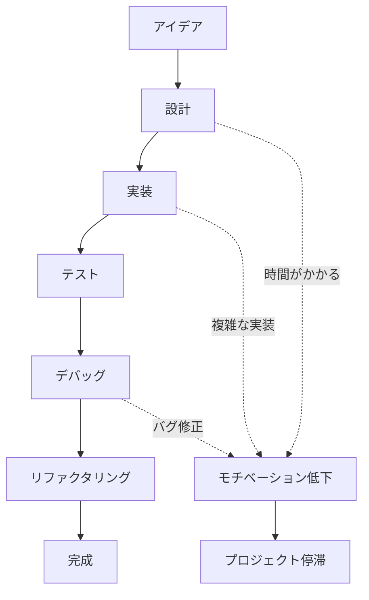
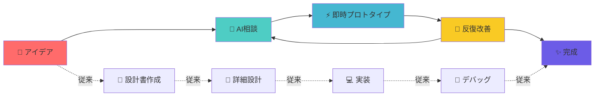
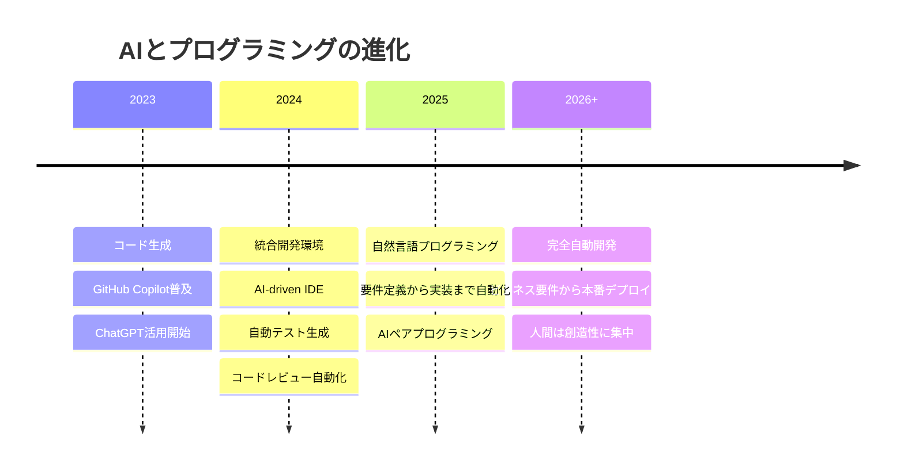

# Vibe Coding with AI

生成AIを活用したプログラミング手法

<div class="pt-12">
  <span @click="$slidev.nav.next" class="px-2 py-1 rounded cursor-pointer" hover="bg-white bg-opacity-10">
    Start Presentation <carbon:arrow-right class="inline"/>
  </span>
</div>

<div class="abs-br m-6 flex gap-2">
  <a href="https://github.com/slidevjs/slidev" target="_blank" alt="GitHub"
    class="text-xl slidev-icon-btn opacity-50 !border-none !hover:text-white">
    <carbon-logo-github />
  </a>
</div>

---
transition: fade-out
---

# 目次

<Toc maxDepth="1"></Toc>

---
layout: image-right
image: https://images.unsplash.com/photo-1555949963-aa79dcee981c?ixlib=rb-4.0.3&ixid=M3wxMjA3fDB8MHxwaG90by1wYWdlfHx8fGVufDB8fHx8fA%3D%3D&auto=format&fit=crop&w=2340&q=80
---

# Vibe Codingとは？

直感的で自然なプログラミングアプローチ

- 🎵 **コードの"感覚"を重視** - 厳密な設計よりも直感的な開発
- 🚀 **素早いプロトタイピング** - アイデアをすぐにコードに変換
- 🎨 **創造性の重視** - 美しく読みやすいコードを追求
- 🔄 **反復的改善** - 小さな変更を積み重ねて完成度を高める
- 💡 **実験的な手法** - 新しい技術や手法を積極的に試す

<style>
h1 {
  background-color: #2B90B6;
  background-image: linear-gradient(45deg, #4EC5D4 10%, #146b8c 20%);
  background-size: 100%;
  -webkit-background-clip: text;
  -moz-background-clip: text;
  -webkit-text-fill-color: transparent;
  -moz-text-fill-color: transparent;
}
</style>

---

# なぜ生成AIが必要なのか？

従来のプログラミングの課題



<v-clicks>

- ⏰ **時間のかかる設計フェーズ**
- 🔧 **複雑な実装の壁**
- 🐛 **デバッグの無限ループ**
- 📚 **ドキュメント作成の負担**

</v-clicks>

---
layout: two-cols
---

# 従来のアプローチ

<v-clicks>

## ❌ 時間のかかるプロセス

```python
# 1. 要件定義
# 2. 設計書作成
# 3. アーキテクチャ設計
# 4. 詳細設計
# 5. 実装
# 6. テスト
# 7. ドキュメント更新

def calculate_total(items):
    """
    商品リストの合計金額を計算する関数
    
    Args:
        items (list): 商品リスト
        
    Returns:
        float: 合計金額
    """
    total = 0
    for item in items:
        if 'price' in item:
            total += item['price']
    return total
```

</v-clicks>

::right::

# AIを活用したアプローチ

<v-clicks>

## ✅ 瞬時にコード生成

```python
# AI prompt: "商品リストの合計を計算する関数を作って"

def calculate_total(items):
    return sum(item.get('price', 0) for item in items)

# さらに機能追加
# "税込み計算も追加して"

def calculate_total_with_tax(items, tax_rate=0.1):
    subtotal = sum(item.get('price', 0) for item in items)
    return subtotal * (1 + tax_rate)

# テストも自動生成
# "このコードのテストケースを作って"

def test_calculate_total():
    items = [{'price': 100}, {'price': 200}]
    assert calculate_total(items) == 300
```

</v-clicks>

---
layout: image-right
image: https://images.unsplash.com/photo-1676299081847-824916de030a?ixlib=rb-4.0.3&ixid=M3wxMjA3fDB8MHxwaG90by1wYWdlfHx8fGVufDB8fHx8fA%3D%3D&auto=format&fit=crop&w=2340&q=80
---

# 生成AIの種類と特徴

プログラミングに適したAIツール

<v-clicks>

## 🤖 **ChatGPT/GPT-4**
- 自然言語でのコード説明
- アーキテクチャ設計のアドバイス
- コードレビューとリファクタリング

## 🚀 **GitHub Copilot**
- リアルタイムコード補完
- コンテキストを理解した提案
- IDE統合による快適な開発体験

## 🎯 **Claude**
- 長いコンテキストの理解
- 複雑なロジックの説明
- エラー解析と修正提案

</v-clicks>

---

# Vibe Coding with AIのワークフロー



<v-clicks>

**ポイント**: 設計よりも**実行**を重視！

</v-clicks>

---
layout: two-cols
---

# 実践例：Web APIの作成

## 🎯 目標
シンプルなTODOアプリのAPIを作る

<v-clicks>

## 🤖 AIとの会話

**Me**: "FastAPIでTODO管理のAPIを作りたい"

**AI**: "基本的なCRUD操作のAPIを作成しますね！"

</v-clicks>

::right::

<v-clicks>

## ⚡ 生成されたコード

```python
from fastapi import FastAPI
from pydantic import BaseModel
from typing import List

app = FastAPI()

class Todo(BaseModel):
    id: int
    title: str
    completed: bool = False

todos = []

@app.get("/todos", response_model=List[Todo])
def get_todos():
    return todos

@app.post("/todos", response_model=Todo)
def create_todo(todo: Todo):
    todos.append(todo)
    return todo

@app.put("/todos/{todo_id}")
def update_todo(todo_id: int, todo: Todo):
    for i, t in enumerate(todos):
        if t.id == todo_id:
            todos[i] = todo
            return todo
    return {"error": "Todo not found"}
```

**わずか数秒で動作するAPIが完成！**

</v-clicks>

---

# AIプロンプトのコツ

効果的なプロンプトの書き方

<v-clicks>

## 🎯 **具体的で明確な指示**

❌ **悪い例**: "ウェブサイトを作って"

✅ **良い例**: "Vue.js 3とTailwind CSSを使って、ユーザー登録フォームのあるランディングページを作って"

## 🏗️ **段階的な指示**

```
1. "まず基本的な構造を作って"
2. "次にスタイルを追加して"
3. "最後にバリデーション機能を追加して"
```

## 🎨 **コンテキストの提供**

"既存のReactプロジェクトに、Material-UIを使ったダッシュボード画面を追加したい"

</v-clicks>

---
layout: two-cols
---

# 実際のプロンプト例

## 📝 **初期作成**

```
React TypeScriptで商品管理画面を作って。
以下の機能が必要：

- 商品一覧表示
- 商品追加フォーム
- 商品編集機能
- 削除確認ダイアログ

スタイルはTailwind CSSで、
モダンでシンプルなデザインにして。
```

::right::

## 🔧 **機能追加**

```
さっきの商品管理画面に以下を追加：

- 検索機能（商品名で絞り込み）
- カテゴリ別フィルター
- ページネーション
- CSVエクスポート機能

パフォーマンスも考慮してください。
```

<v-clicks>

## 🎨 **リファクタリング**

```
このコードをより保守性の高い構造に
リファクタリングして：

- カスタムフックに分離
- コンポーネントの再利用性向上
- TypeScriptの型安全性強化
```

</v-clicks>

---

# デバッグとエラー解決

AIを使った効率的なデバッグ

<v-clicks>

## 🐛 **エラーメッセージをそのまま貼り付け**

```
TypeError: Cannot read property 'map' of undefined
    at ProductList.tsx:25:12
    at Array.map (<anonymous>)
```

**AIプロンプト**: "このエラーを修正して" + エラーメッセージ

</v-clicks>

<v-clicks>

## 🔍 **コード全体を共有**

```
以下のコードでAPIからデータが取得できません。
何が問題でしょうか？

[コード全体を貼り付け]
```

</v-clicks>

<v-clicks>

## 💡 **AIの回答例**

"useEffectの依存配列が空のため、APIコールが実行されていません。また、データの初期値がundefinedなので、mapメソッドでエラーが発生しています。"

</v-clicks>

---
layout: image-right
image: https://images.unsplash.com/photo-1553877522-43269d4ea984?ixlib=rb-4.0.3&ixid=M3wxMjA3fDB8MHxwaG90by1wYWdlfHx8fGVufDB8fHx8fA%3D%3D&auto=format&fit=crop&w=2340&q=80
---

# Vibe Codingの効果

実際の開発での効果測定

<v-clicks>

## ⚡ **開発速度の向上**
- プロトタイプ作成: **90%短縮**
- バグ修正時間: **70%短縮**
- 新機能実装: **60%短縮**

## 🎯 **品質の向上**
- コードレビューの精度向上
- ベストプラクティスの自動適用
- テストカバレッジの向上

## 🚀 **学習効果**
- 新しい技術の習得が加速
- コーディングパターンの理解深化
- アーキテクチャ設計スキルの向上

</v-clicks>

---

# 注意点とベストプラクティス

AIを活用する上での重要なポイント

<v-clicks>

## ⚠️ **注意点**

- **盲目的な信頼は危険** - 生成されたコードの検証は必須
- **セキュリティの確認** - 特に認証・認可まわりは要注意
- **パフォーマンスの検証** - 最適化されていない可能性
- **ライセンス問題** - オープンソースコードの混在に注意

## ✅ **ベストプラクティス**

- 小さな単位でコード生成 → 検証 → 統合
- 重要な部分は必ず手動レビュー
- テストコードも同時に生成
- 段階的なリファクタリング

</v-clicks>

---
layout: two-cols
---

# 具体的な活用事例

## 🏗️ **アーキテクチャ設計**

```
マイクロサービス構成のECサイトを
設計したい。以下の要件で：

- ユーザー管理サービス
- 商品カタログサービス
- 注文処理サービス
- 決済サービス

各サービス間の通信方法と
データベース設計も含めて。
```

## 🎨 **UI/UX実装**

```
ダークモード対応のダッシュボードを
作って。以下の要素が必要：

- サイドバーナビゲーション
- グラフ表示エリア
- 通知機能
- ユーザープロファイル

レスポンシブ対応も含めて。
```

::right::

## 🔧 **パフォーマンス最適化**

```
このReactコンポーネントが重いので
最適化して：

- 不要な再レンダリング防止
- メモ化の適用
- バンドルサイズの削減
- ローディング状態の改善

[重いコンポーネントのコード]
```

## 🧪 **テスト実装**

```
この機能のテストケースを作って：

- 正常系のテスト
- 異常系のテスト
- エッジケースのテスト
- E2Eテストのシナリオ

Jest + React Testing Libraryで。
```

---

# Vibe Codingの将来展望

次世代の開発手法への進化



<v-clicks>

**未来のプログラマー**: コードを書くのではなく、**アイデアを形にする人**

</v-clicks>

---

# 実践課題

今日から始められるVibe Coding

<v-clicks>

## 🎯 **初級レベル**
- GitHub Copilotを使って関数を自動補完
- ChatGPTでコードレビューを依頼
- エラーメッセージをAIに相談

## 🚀 **中級レベル**
- 小規模なアプリを丸ごとAIで作成
- 既存コードのリファクタリング
- テストケースの自動生成

## 🌟 **上級レベル**
- アーキテクチャ設計をAIと相談
- パフォーマンス最適化の提案を求める
- 新技術の学習をAIでサポート

</v-clicks>

---
layout: center
class: text-center
---

# まとめ

<v-clicks>

## 🎵 **Vibe Coding = 直感的プログラミング**

AIを活用して、アイデアを瞬時にコードに変換

## ⚡ **圧倒的な生産性向上**

従来の開発プロセスを根本から変革

## 🚀 **創造性への集中**

技術的な制約から解放され、真の価値創造へ

</v-clicks>

<div class="pt-12">
  <span class="px-2 py-1 rounded bg-blue-600 text-white">
    今日からVibe Codingを始めよう！
  </span>
</div>

---
layout: center
class: text-center
---

# Thank You!

質問・ディスカッションタイム

<div class="pt-12">
  <span class="text-6xl">🤖💻✨</span>
</div>

<style>
h1 {
  background-color: #2B90B6;
  background-image: linear-gradient(45deg, #4EC5D4 10%, #146b8c 20%);
  background-size: 100%;
  -webkit-background-clip: text;
  -moz-background-clip: text;
  -webkit-text-fill-color: transparent;
  -moz-text-fill-color: transparent;
}
</style>
